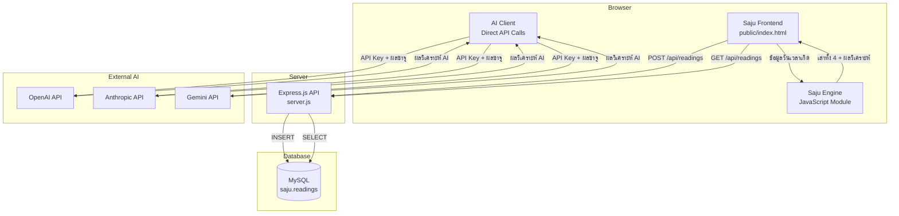
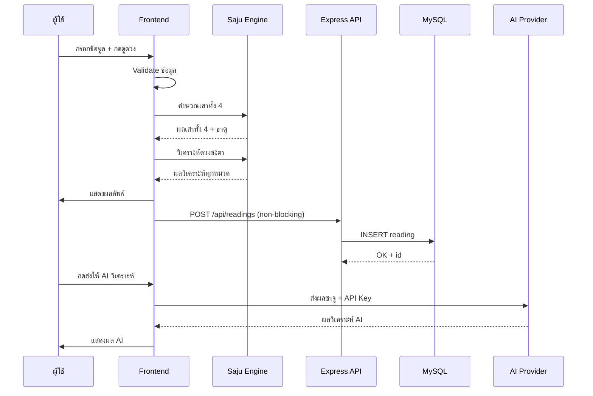
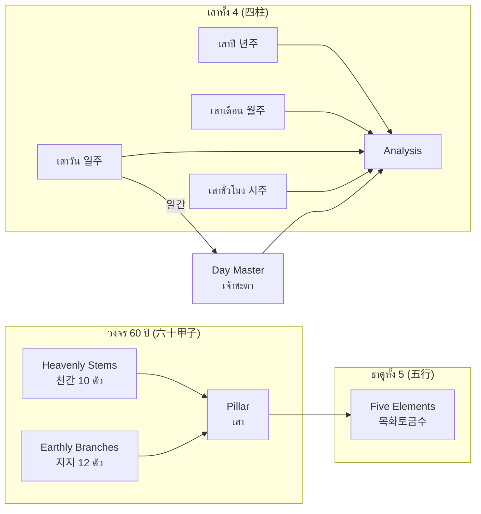

# เอกสารออกแบบ (Design Document): ระบบดูดวงซาจู (사주)

## ภาพรวม (Overview)

ระบบดูดวงซาจูเป็นเว็บแอปพลิเคชันที่ประกอบด้วย Frontend แบบ Single Page (HTML/CSS/JS + Tailwind CSS CDN) และ Backend (Express.js + MySQL) ผู้ใช้กรอกข้อมูลวันเวลาเกิดผ่านฟอร์ม ระบบคำนวณเสาทั้ง 4 (四柱) ตามหลักโหราศาสตร์เกาหลี วิเคราะห์ดวงชะตาตามสมดุลธาตุทั้ง 5 (五行) แสดงผลลัพธ์ในธีมมืดสมัยใหม่ รองรับการคัดลอกผลลัพธ์ บันทึกลงฐานข้อมูล MySQL และส่งผลวิเคราะห์ไปยัง AI ภายนอก (OpenAI, Anthropic, Gemini) เพื่อวิเคราะห์เพิ่มเติม

### การตัดสินใจออกแบบหลัก

1. **Frontend-centric calculation**: การคำนวณซาจูทั้งหมดทำฝั่ง client (JavaScript) เพื่อให้ผลลัพธ์แสดงทันทีโดยไม่ต้องรอ server
2. **Single HTML file**: ใช้ไฟล์ `public/index.html` เดียวรวม HTML, CSS, JS เพื่อความเรียบง่ายในการ deploy
3. **Client-side AI calls**: เรียก API ของ AI providers โดยตรงจาก browser เพื่อไม่ต้อง proxy ผ่าน server (ผู้ใช้กรอก API key เอง)
4. **Non-blocking save**: บันทึกผลลงฐานข้อมูลแบบ fire-and-forget ไม่บล็อกการแสดงผล

## สถาปัตยกรรม (Architecture)



### ลำดับการทำงาน (Sequence)



## คอมโพเนนต์และอินเทอร์เฟซ (Components and Interfaces)

### 1. Saju Frontend (`public/index.html`)

ไฟล์ HTML เดียวที่รวมทุกอย่าง ใช้ Tailwind CSS CDN สำหรับ styling

**ส่วนประกอบ UI:**
- **Form Section**: ฟอร์มกรอกข้อมูล (ชื่อ, เพศ, วันเกิด, เวลาเกิด)
- **Result Section**: แสดงผลลัพธ์ (Day Master, ตารางเสาทั้ง 4, แผนภูมิธาตุ, ผลวิเคราะห์)
- **Copy Button**: ปุ่มคัดลอกผลลัพธ์ไป clipboard
- **AI Section**: ส่วนเลือก AI provider, กรอก API key, prompt เพิ่มเติม, แสดงผล AI

### 2. Saju Engine (JavaScript ใน `index.html`)

โมดูลคำนวณซาจูฝั่ง client:

```
ฟังก์ชันหลัก:
- getYearPillar(year) → { stem, branch }
- getMonthPillar(year, month) → { stem, branch }
- getDayPillar(year, month, day) → { stem, branch }
- getHourPillar(dayStem, hour) → { stem, branch }
- analyzeElements(pillars) → { 목, 화, 토, 금, 수 }
- getAnalysis(dayMasterStem, elementCount) → sections[]
- pillarStr(pillar) → string (เช่น "갑자")
- pillarHanja(pillar) → string (เช่น "甲子")
```

**ข้อมูลคงที่ (Constants):**
- `STEMS`: ราศีสวรรค์ 10 ตัว (갑을병정무기경신임계)
- `BRANCHES`: ราศีโลก 12 ตัว (자축인묘진사오미신유술해)
- `STEM_ELEMENTS`: แมปราศีสวรรค์ → ธาตุ
- `BRANCH_ELEMENTS`: แมปราศีโลก → ธาตุ
- `PERSONALITY`: ข้อมูลบุคลิกภาพตาม Day Master

### 3. AI Client (JavaScript ใน `index.html`)

เรียก API ของ AI providers โดยตรงจาก browser:

```
ฟังก์ชัน:
- askAI() → void
  - รองรับ 3 providers: openai, anthropic, gemini
  - ส่ง system prompt (นักโหราศาสตร์เกาหลี) + ผลซาจู + prompt เพิ่มเติม
  - แสดงสถานะ loading และผลลัพธ์/error
```

**API Endpoints ของแต่ละ Provider:**
| Provider | Endpoint | Auth Header |
|----------|----------|-------------|
| OpenAI | `POST https://api.openai.com/v1/chat/completions` | `Authorization: Bearer {key}` |
| Anthropic | `POST https://api.anthropic.com/v1/messages` | `x-api-key: {key}` |
| Gemini | `POST https://generativelanguage.googleapis.com/v1beta/models/gemini-2.0-flash:generateContent?key={key}` | Query param |

### 4. Express API (`server.js`)

REST API สำหรับบันทึกและดึงข้อมูลการดูดวง:

```
Endpoints:
- POST /api/readings
  Request Body: { name, birthDate, birthTime, gender, yearPillar, monthPillar, dayPillar, hourPillar, resultText }
  Response: { id, message }

- GET /api/readings
  Response: [{ id, name, birth_date, birth_time, gender, year_pillar, month_pillar, day_pillar, hour_pillar, result_text, created_at }, ...]

Static Files:
- GET /* → serve public/ directory
```

**การเชื่อมต่อ MySQL:**
- Host: `localhost`
- User: `root`
- Password: `1234`
- Database: `saju`
- Port: `3306`

## โมเดลข้อมูล (Data Models)

### ตาราง `readings` (MySQL)

```sql
CREATE TABLE IF NOT EXISTS readings (
  id INT AUTO_INCREMENT PRIMARY KEY,
  name VARCHAR(255) NOT NULL,
  birth_date DATE NOT NULL,
  birth_time TIME NOT NULL,
  gender ENUM('male', 'female') NOT NULL,
  year_pillar VARCHAR(10) NOT NULL,
  month_pillar VARCHAR(10) NOT NULL,
  day_pillar VARCHAR(10) NOT NULL,
  hour_pillar VARCHAR(10) NOT NULL,
  result_text TEXT NOT NULL,
  created_at TIMESTAMP DEFAULT CURRENT_TIMESTAMP
);
```

### โมเดลข้อมูลฝั่ง Client (JavaScript Objects)

```javascript
// Pillar object
{ stem: number (0-9), branch: number (0-11) }

// Element count
{ '목': number, '화': number, '토': number, '금': number, '수': number }

// Analysis section
{ title: string, content: string }

// Last result (stored in global variable)
{
  name: string,
  gender: string,
  birthdate: string,
  birthtime: string,
  yearP: string,    // เช่น "갑자"
  monthP: string,
  dayP: string,
  hourP: string,
  yearPH: string,   // เช่น "甲子"
  monthPH: string,
  dayPH: string,
  hourPH: string,
  dayMaster: string,
  elementCount: object,
  analysis: array
}
```

### ความสัมพันธ์ของข้อมูลซาจู



### ตารางแมปเวลาเกิด → Earthly Branch (시진/時辰)

| ช่วงเวลา | Earthly Branch | ชื่อเกาหลี |
|-----------|---------------|------------|
| 23:00-01:00 | 자(子) | 자시 |
| 01:00-03:00 | 축(丑) | 축시 |
| 03:00-05:00 | 인(寅) | 인시 |
| 05:00-07:00 | 묘(卯) | 묘시 |
| 07:00-09:00 | 진(辰) | 진시 |
| 09:00-11:00 | 사(巳) | 사시 |
| 11:00-13:00 | 오(午) | 오시 |
| 13:00-15:00 | 미(未) | 미시 |
| 15:00-17:00 | 신(申) | 신시 |
| 17:00-19:00 | 유(酉) | 유시 |
| 19:00-21:00 | 술(戌) | 술시 |
| 21:00-23:00 | 해(亥) | 해시 |

